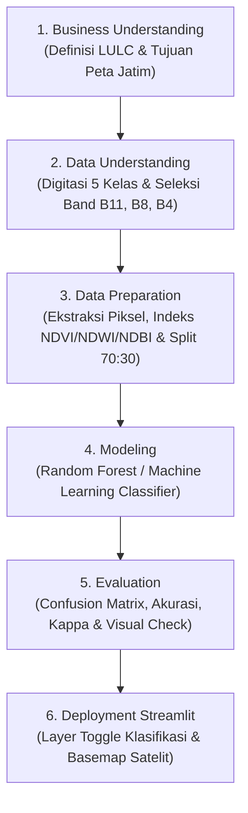

# Panduan & Spesifikasi Proyek Tugas Pengganti UTS
## Analisis Land Use and Land Cover (LULC) Menggunakan Citra Satelit Optik & Streamlit Deployment

Dokumen ini berisi rangkuman instruksi dosen, spesifikasi kebutuhan proyek, arsitektur alur kerja CRISP-DM, serta peta jalan pengerjaan bertahap untuk **Tugas Pengganti Ujian Tengah Semester (UTS)** mata kuliah Penambangan Data & Sains Data (PSD).

---

## 📌 1. Business Understanding

### 1.1 Apakah itu Land Use and Land Cover (LULC)?
- **Land Cover (Penutupan Lahan):** Kenampakan fisik vegetasi, air, tanah, bangunan, atau material permukaan bumi yang terekam oleh sensor satelit (misal: Hutan Mangrove, Air, Bangunan).
- **Land Use (Penggunaan Lahan):** Fungsi pemanfaatan lahan oleh aktivitas manusia (misal: Pertanian/Sawah, Pemukiman, Kawasan Industri).

### 1.2 Tujuan Analisis
1. **Identifikasi & Pemetaan Otomatis:** Memetakan dan mengklasifikasikan tutupan lahan di wilayah kajian (Provinsi Jawa Timur) secara akurat menggunakan citra satelit optik Sentinel-2.
2. **Diferensiasi Khusus Hutan Mangrove:** Membedakan secara spesifik vegetasi **Hutan Mangrove** dengan **Hutan Non-Mangrove** dan **Pertanian** berdasarkan perbedaan respon spektral pada band SWIR (B11), NIR (B08), dan Red (B04).
3. **Verifikasi Visual Overlay:** Menampilkan hasil klasifikasi lahan berupa *interactive layer overlay* di atas citra satelit dasar (*basemap*) untuk memvalidasi kebenaran label klasifikasi.
4. **Deployment Aplikasi Interaktif:** Membangun aplikasi web interaktif berbasis **Streamlit** untuk menyajikan hasil analisis tutupan lahan Jawa Timur secara mudah dan informatif bagi *stakeholder*.

---

## 🏷️ 2. Kelas Tutupan Lahan (5 Kelas Klasifikasi)

Digitasi sampel area dilakukan untuk 5 kelas lahan utama:
1. 🌾 **Pertanian / Sawah:** Lahan vegetasi musiman dan tanah bercocok tanam.
2. 🏠 **Bangunan / Pemukiman (Built-up):** Area terbangun, perumahan, gedung, dan infrastruktur.
3. 💧 **Air (Water Bodies):** Sungai, waduk, laut, dan tambak air.
4. 🌲 **Hutan (Non-Mangrove):** Vegetasi pepohonan daratan / hutan dataran tinggi.
5. 🌊 **Hutan Mangrove:** Vegetasi khas pesisir pantai dan muara sungai.
---

## 🛰️ 3. Data Understanding & Ekstraksi Band Satelit

### 3.1 Pemilihan Band Spektral Kunci
Untuk membedakan ke-5 kelas lahan (terutama Hutan Mangrove vs Hutan Darat vs Air vs Bangunan), band satelit yang dipilih adalah:
- **Band 11 (SWIR - Shortwave Infrared ~ 1610 nm):** Sangat sensitif terhadap kelembapan tanah, kandungan air daun, serta pembeda tegas antara material bangunan/beton (NDBI tinggi) dan tanah/vegetasi.
- **Band 8 (NIR - Near Infrared ~ 842 nm):** Memiliki reflektansi tinggi pada vegetasi sehat; sangat berguna membedakan vegetasi padat (hutan/mangrove) dengan air/bangunan.
- **Band 4 (Red ~ 665 nm):** Menyerap klorofil tanaman; digunakan bersama NIR untuk menghitung Indeks Vegetasi (**NDVI**).
- **Band 3 (Green ~ 560 nm) & Band 2 (Blue ~ 490 nm):** Digunakan untuk komposit warna alami (*True Color*) dan perhitungan Indeks Kebasahan/Air (**NDWI**).

---

## ⚙️ 4. Tahapan Pengerjaan Proyek (CRISP-DM Workflow)

---

## 📊 5. Rencana & Fitur Aplikasi Deployment Streamlit

Aplikasi web **Streamlit** yang dibangun akan menyediakan fitur-fitur interaktif berikut:
1. **Interactive Layer Control (Tampilan Multi-Layer):**
   - **Layer 1:** Hasil Klasifikasi Lahan (Warna khusus per kelas lahan yang ditempel transparan di atas citra satelit).
   - **Layer 2:** Peta Satelit Dasar (*Basemap Satellite Image*).
2. **Filter Checklist Kelas Interaktif:**
   - Pengguna dapat memilih/men-centang kelas lahan tertentu (misal: *Centang 'Hutan Mangrove' saja*).
   - Peta hanya akan menampilkan overlay warna untuk kelas yang dicentang sehingga mudah diverifikasi.
3. **Dashboard Informasi LULC Jawa Timur:**
   - Grafik persentase dan estimasi total luas lahan ($km^2$) per kelas tutupan lahan.
   - Panel metrik evaluasi model (Akurasi, Cohen's Kappa, Confusion Matrix).

---

## 🗓️ 6. Peta Jalan Pengerjaan Bertahap (Roadmap)

| Tahap | Deskripsi Pekerjaan | Status |
| :---: | :------------------ | :----: |
| **Tahap 1** | Merapikan Spesifikasi & Dokumen `uts/tugas-uts.md` & `_toc.yml` | ✅ Selesai |
| **Tahap 2** | Menyiapkan GeoJSON 5 Kelas (`Pertanian`, `Bangunan`, `Air`, `Hutan`, `Mangrove`) | ⏳ Berikutnya |
| **Tahap 3** | Membuat Notebook Klasifikasi 5 Kelas (`uts/code-uts.ipynb`) | ⏳ Mendatang |
| **Tahap 4** | Ekstraksi Band (B11, B08, B04 dll), Indeks Spektral & Evaluasi RF | ⏳ Mendatang |
| **Tahap 5** | Pembuatan Aplikasi Streamlit Interaktif (`app.py`) dengan Toggle Layer | ⏳ Mendatang |
